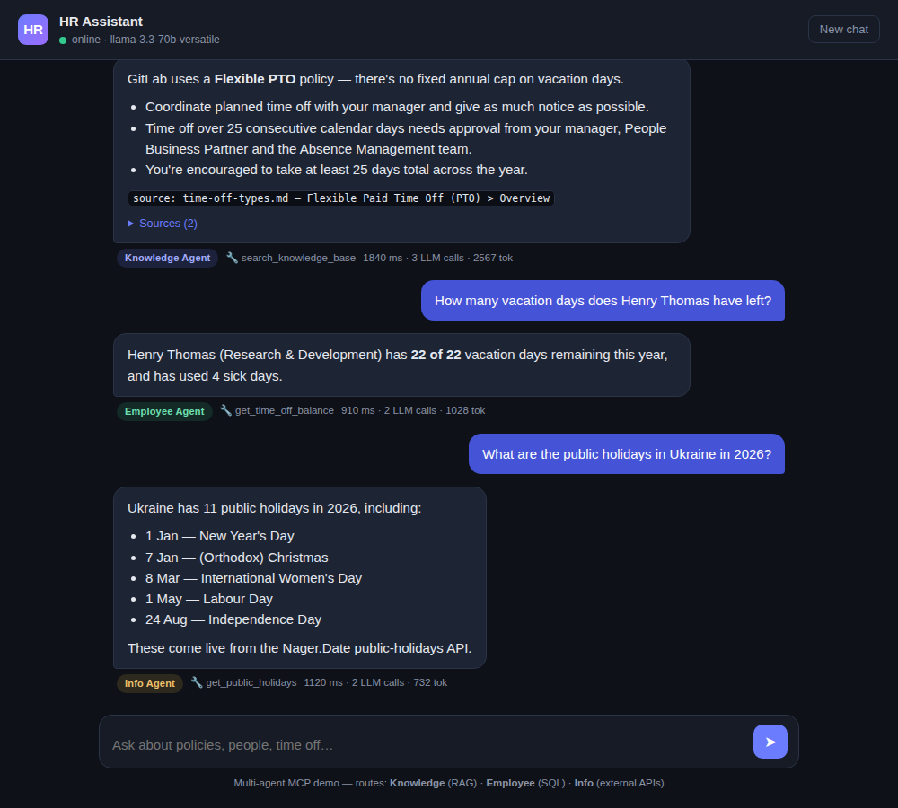
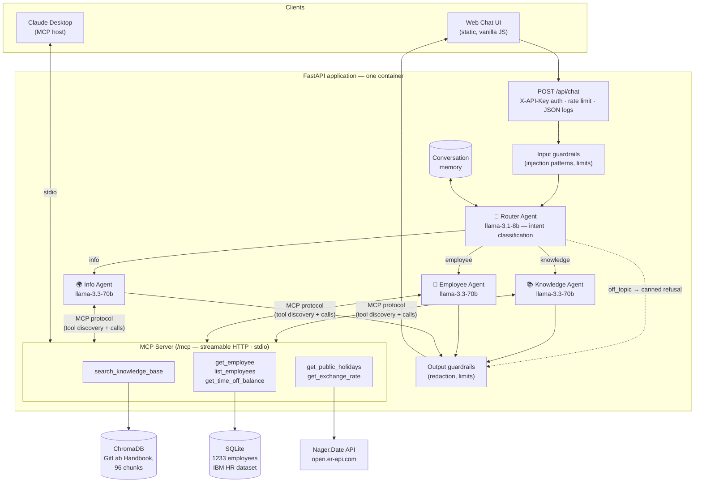

# HR Assistant — Multi-Agent MCP System with RAG

[](https://github.com/yuriiant-md/HR-Assistant-Multi-Agent/actions/workflows/ci.yml)


A production-ready **MCP agent** for a corporate Q&A scenario: employees chat with an HR
assistant that answers policy questions from the company handbook (**RAG**), looks up people
and time-off balances in a **database**, and fetches public holidays / exchange rates from
**live external APIs** — all through a **multi-agent architecture** (an intent router plus
three specialist agents) talking to a single **MCP server** over the Model Context Protocol.

Built with plain Python and a transparent agentic loop — no LangChain, no magic.



---

## How it works



**Request lifecycle:** every message passes deterministic input guardrails, then a cheap/fast
router model classifies the intent (`knowledge` / `employee` / `info` / `off_topic`). Off-topic
requests get a canned refusal without ever reaching a specialist. Otherwise the matching
specialist agent runs a transparent tool-calling loop — it discovers and invokes tools **over
the MCP protocol** (never as direct function calls), with each agent restricted to the tools
of its own domain (least privilege). The reply passes output guardrails, the turn is stored
in per-session memory, and the UI shows which agent answered plus the RAG sources it cited.

## Course requirements → implementation map

| Requirement | Where |
|---|---|
| LLM logic: prompting strategies, system constraints | [`agents/prompts.py`](src/hr_assistant/agents/prompts.py), documented in the [Prompt Book](docs/PROMPTS.md) |
| External data architecture: RAG **and** multi-agent | [`rag/`](src/hr_assistant/rag) (chunking + ChromaDB), [`agents/`](src/hr_assistant/agents) (router + 3 specialists) |
| MCP architecture: context + request routing | [`mcp_server/`](src/hr_assistant/mcp_server) (6 tools, HTTP + stdio), [`agents/router.py`](src/hr_assistant/agents/router.py), [`agents/memory.py`](src/hr_assistant/agents/memory.py) |
| Real data sources: files, DB, external APIs | GitLab Handbook markdown ([attribution](data/docs/ATTRIBUTION.md)), SQLite from the IBM HR dataset, Nager.Date + open.er-api.com |
| Business scenario | Corporate HR/onboarding Q&A assistant |
| Security: access control, safe context boundaries | API-key auth, rate limiting, [`guardrails/`](src/hr_assistant/guardrails), sensitive DB columns never selected ([`db/queries.py`](src/hr_assistant/db/queries.py)), per-agent tool allowlists |
| Infrastructure: deploy, CI/CD, logging, monitoring | [Dockerfile](Dockerfile), [CI](.github/workflows/ci.yml) + [Cloud Run deploy](.github/workflows/deploy.yml), JSON logs, `/health` + `/metrics` |

---

## Quickstart (local)

Prerequisites: Python 3.11+, ~1 GB of disk (embedding model), a free
[Groq API key](https://console.groq.com/keys).

```bash
git clone https://github.com/yuriiant-md/HR-Assistant-Multi-Agent.git
cd HR-Assistant-Multi-Agent

pip install -e ".[dev]"

# build the data artifacts (SQLite DB + vector index; downloads an 80 MB ONNX model once)
make data          # or: python data/seed_db.py && python scripts/ingest.py

cp .env.example .env    # put your Groq key into LLM_API_KEY
make run                # or: python -m hr_assistant
```

Open **http://localhost:8080** and ask:

- *"How much paid time off can I take per year?"* → Knowledge Agent, answers with handbook citations
- *"What team is Olivia Smith on?"* → Employee Agent, SQLite lookup
- *"How many vacation days does Henry Thomas have left?"* → Employee Agent, balance math
- *"Public holidays in Ukraine in 2026?"* → Info Agent, live external API
- *"Write me a poem"* → polite off-topic refusal (guardrail)

### Docker

```bash
docker compose up --build        # reads LLM_API_KEY from .env
```

The image is self-contained: the vector index, the employee DB and the embedding model are
baked in at build time, so the container needs no network access at startup.

### Use the MCP server from Claude Desktop

The same six tools are exposed over stdio for any MCP host. Add to
`claude_desktop_config.json`:

```json
{
  "mcpServers": {
    "hr-assistant": {
      "command": "python",
      "args": ["-m", "hr_assistant.mcp_server"],
      "cwd": "/absolute/path/to/HR-Assistant-Multi-Agent",
      "env": { "PYTHONPATH": "src" }
    }
  }
}
```

Restart Claude Desktop and ask it e.g. *"Using the hr-assistant tools, what is the PTO
policy?"* — Claude will call the same MCP server our own agents use.

---

## API

| Method | Path | Description |
|---|---|---|
| `POST` | `/api/chat` | Chat with the assistant (`X-API-Key` header if auth enabled) |
| `GET` | `/health` | Liveness + dependency checks (index, DB, LLM config) |
| `GET` | `/metrics` | Request/token/latency counters (JSON) |
| `GET` | `/api/config` | Public UI config (auth required?, models) |
| `POST` | `/mcp` | MCP streamable-HTTP endpoint (JSON-RPC) |
| `GET` | `/` | Web chat UI |

```bash
curl -X POST http://localhost:8080/api/chat \
  -H "Content-Type: application/json" \
  -d '{"message": "How much PTO can I take?", "session_id": "demo1"}'
```

```json
{
  "reply": "GitLab has a Flexible PTO policy... [source: time-off-types.md — Flexible Paid Time Off (PTO)]",
  "route": "knowledge",
  "agent": "Knowledge Agent",
  "sources": [{"source": "time-off-types.md", "section": "Flexible Paid Time Off (PTO) > Overview", "score": 0.49, "snippet": "..."}],
  "tool_calls": [{"tool": "search_knowledge_base", "arguments": {"query": "PTO policy limits"}}],
  "usage": {"llm_calls": 3, "prompt_tokens": 2411, "completion_tokens": 156},
  "elapsed_ms": 1840
}
```

## Configuration

Everything is set via environment variables (see [`.env.example`](.env.example)):

| Variable | Default | Purpose |
|---|---|---|
| `LLM_API_KEY` | — | **Required.** Groq (or other provider) API key |
| `LLM_BASE_URL` | `https://api.groq.com/openai/v1` | Any OpenAI-compatible endpoint (OpenAI, Ollama…) |
| `LLM_MODEL` | `llama-3.3-70b-versatile` | Model for specialist agents |
| `ROUTER_MODEL` | `llama-3.1-8b-instant` | Cheap/fast model for intent routing |
| `APP_API_KEY` | *(empty)* | If set, `/api/chat` requires `X-API-Key` |
| `RATE_LIMIT_PER_MINUTE` | `20` | Per-client sliding-window limit |
| `TRUSTED_PROXIES` | *(empty)* | CIDRs/IPs whose `X-Forwarded-For` we trust for rate-limit keying. Empty = never trust XFF |
| `MAX_AGENT_ITERATIONS` | `5` | Hard cap for the agentic loop |
| `PORT` | `8080` | Listen port (Cloud Run sets this) |

Switching providers = changing 2–3 env vars: e.g. `LLM_BASE_URL=http://localhost:11434/v1`
+ `LLM_MODEL=llama3.1` for Ollama, or `LLM_BASE_URL=https://api.openai.com/v1` +
`LLM_MODEL=gpt-4o-mini` for OpenAI.

---

## Deployment — Google Cloud Run

Manual (one command, from the repo root):

```bash
gcloud auth login
gcloud config set project YOUR_PROJECT_ID
gcloud services enable run.googleapis.com cloudbuild.googleapis.com artifactregistry.googleapis.com

gcloud run deploy hr-assistant \
  --source . --region europe-west1 --allow-unauthenticated \
  --memory 1Gi --set-env-vars "LLM_API_KEY=gsk_...,APP_API_KEY=choose-a-secret"
```

Continuous deployment via [GitHub Actions](.github/workflows/deploy.yml):

1. Create a service account with roles **Cloud Run Admin**, **Cloud Build Editor**,
   **Service Account User**, **Artifact Registry Writer**; download the JSON key.
2. Add repo **secrets**: `GCP_SA_KEY`, `GCP_PROJECT_ID`, `GROQ_API_KEY`, `APP_API_KEY`
   and repo **variables**: `GCP_REGION`, `DEPLOY_ENABLED=true`.
3. Push to `main` (or run the workflow manually) — it builds with Cloud Build and deploys.

Cloud Run free tier comfortably covers a course demo; the service scales to zero when idle.

## Security

- **Access control** — optional `X-API-Key` auth (constant-time compare) + per-client rate limiting.
- **Input guardrails** — prompt-injection patterns, length/character limits are checked *before* any LLM call ([`guardrails/filters.py`](src/hr_assistant/guardrails/filters.py)).
- **Topic boundary** — the router closes the intent space; off-topic requests get a deterministic refusal, so the boundary can't be talked around.
- **Least-privilege tools** — each specialist sees only its own MCP tools (the Knowledge agent physically can't query employees).
- **Safe context boundary for data** — sensitive dataset columns (salary, satisfaction scores) are excluded at the SQL layer and can never reach an LLM context.
- **Tool-output injection defense** — system prompts instruct agents to treat tool results strictly as data; output filters redact secret-looking tokens.
- **Secrets** — only via environment variables; nothing sensitive in the repo or image.

## Observability

- **Structured JSON logs** on stdout (Cloud Logging–ready): every HTTP request, routing
  decision, tool call and guardrail block with fields (`route`, `tool`, `duration_ms`…).
- **`/metrics`** — uptime, request counts by route, blocked/rate-limited counts, LLM calls,
  token totals, average chat latency.
- **`/health`** — index chunk count, employee row count, LLM configuration status.

## Testing

```bash
make test   # 46 tests, fully offline: LLM scripted, embeddings faked, external APIs stubbed
make lint
```

CI runs lint + tests + a full Docker build with a container smoke-test on every push.

## Project structure

```
├── src/hr_assistant/
│   ├── mcp_server/        # MCP server: 6 tools, streamable HTTP + stdio entrypoints
│   ├── agents/            # LLM client, agentic loop, router, specialists, prompts, memory
│   ├── guardrails/        # deterministic input/output filters
│   ├── rag/               # markdown chunking + ChromaDB store
│   ├── db/                # read-only SQLite access (safe-field boundary)
│   ├── api/               # FastAPI app, metrics, rate limiter
│   └── config.py          # pydantic-settings (12-factor)
├── data/                  # datasets (committed) + seed script
├── scripts/ingest.py      # docs → chunks → vector index
├── static/index.html      # web chat UI
├── tests/                 # 46 offline tests
└── docs/                  # ARCHITECTURE.md · PROMPTS.md · DEMO.md · diagrams
```

## Data sources

| Source | Used as | License |
|---|---|---|
| [GitLab Employee Handbook](https://gitlab.com/gitlab-com/content-sites/handbook) | RAG corpus (8 pages: PTO, benefits, onboarding, remote work, expenses, conduct) | CC BY-SA 4.0 — [attribution](data/docs/ATTRIBUTION.md) |
| [IBM HR Analytics dataset](https://github.com/IBM/employee-attrition-aif360) | Employee DB (1233 current employees + synthetic names/balances) | open dataset |
| [Nager.Date](https://date.nager.at) / [open.er-api.com](https://www.exchangerate-api.com) | Live external APIs | free, no key |

## License

[MIT](LICENSE). Handbook content © GitLab Inc., CC BY-SA 4.0 (see attribution).
