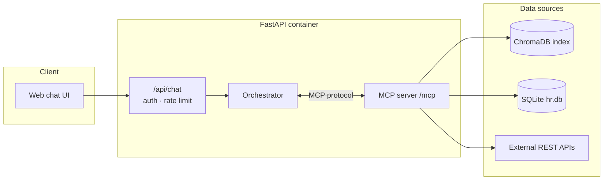
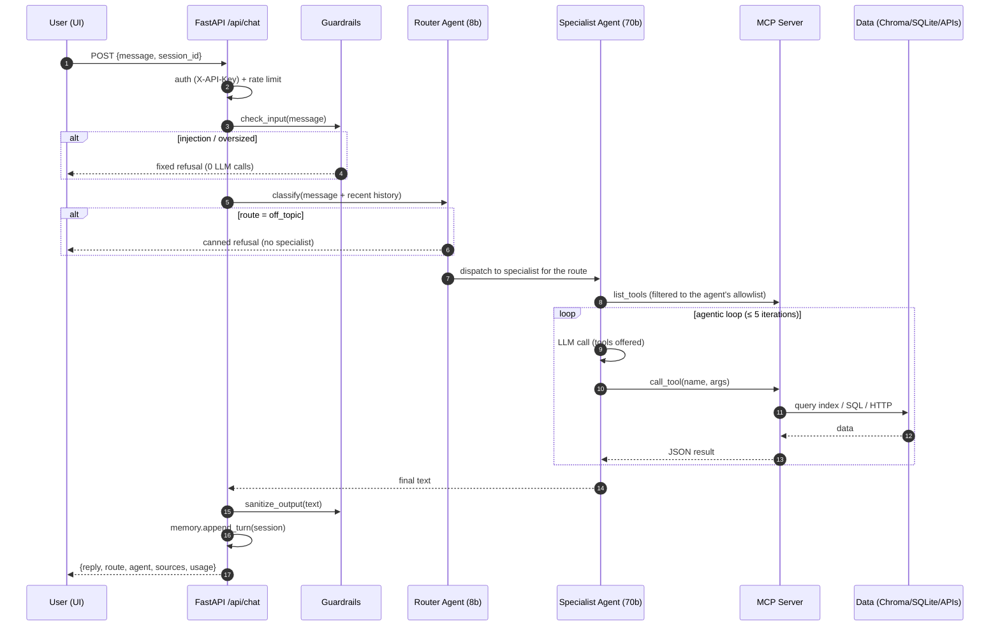
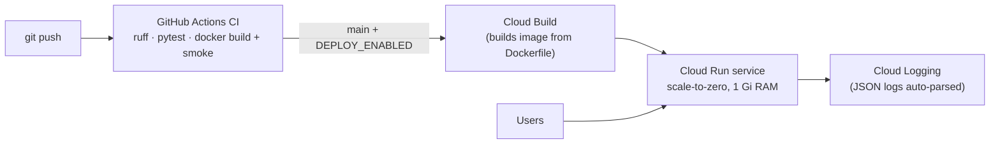

# Architecture

> Editable diagram: [architecture.drawio](architecture.drawio) (open at [app.diagrams.net](https://app.diagrams.net)) ·
> the same diagrams below are Mermaid and render right on GitHub.

## System overview

One deployable FastAPI container hosts three cooperating layers:

1. **The API layer** — chat endpoint, auth, rate limiting, metrics, static UI.
2. **The agent layer** — a router + three specialists with a transparent tool-calling loop.
3. **The MCP server** — the *only* gateway to data: vector index, SQLite, external APIs.

The agents talk to the MCP server **over the MCP protocol** (streamable HTTP to its own
`/mcp` endpoint; in-memory transport in tests). Nothing in the agent layer imports the data
layer directly — swap the MCP server for any other MCP-compliant server and the agents keep
working, or point Claude Desktop at our server and it gets the same six tools.



## Request flow



## Multi-agent design

| Agent | Model | Tools (MCP allowlist) | Job |
|---|---|---|---|
| Router | `llama-3.1-8b-instant` | — none — | Classify intent into a **closed** set of 4 routes; unparseable output falls back to `knowledge` |
| Knowledge | `llama-3.3-70b-versatile` | `search_knowledge_base` | Policy Q&A over the handbook with mandatory retrieval and citations |
| Employee | `llama-3.3-70b-versatile` | `get_employee`, `list_employees`, `get_time_off_balance` | Directory and time-off lookups with privacy rules |
| Info | `llama-3.3-70b-versatile` | `get_public_holidays`, `get_exchange_rate` | Live external facts |

Why this shape:

- **Cost/latency:** ~90 % of routing tokens run on the 8b model; the 70b model is only used
  where quality matters.
- **Least privilege:** tool exposure is decided by the orchestrator, not the model — a
  specialist literally cannot call another domain's tools.
- **Focused prompts:** each specialist's system prompt covers one domain, which measurably
  beats one mega-prompt with all rules at 8–70b model sizes.
- **Deterministic boundaries:** `off_topic` and guardrail blocks bypass LLMs entirely.

## The agentic loop

`agents/loop.py` is a plain `for` loop (mini-agent style, no framework):

```
messages = [system, *history, user]
for i in range(MAX_ITERATIONS):            # default 5
    response = llm.chat(messages, tools)   # tool_choice="none" on the last pass
    if no tool_calls: return response
    for call in tool_calls:
        result = mcp.call_tool(call)       # over the MCP protocol
        messages += [assistant(tool_calls), tool(result)]
```

Every tool call is logged (`tool_call` events) and recorded in the response so the UI can
show which tools ran and which handbook fragments were cited.

## MCP server

Six tools behind one `MCPServer` (official Python SDK), exposed over two transports from
the same code:

| Transport | Consumer | Entry |
|---|---|---|
| Streamable HTTP `/mcp` | our own agents, any remote MCP client | mounted into the FastAPI app |
| stdio | Claude Desktop and other local MCP hosts | `python -m hr_assistant.mcp_server` |

Design choices: tools return **errors as data** (`{"error": ...}`) so calling LLMs can
recover; results are JSON; the RAG tool embeds the query with the same local ONNX model
used at ingest time; the employee tools select from a fixed safe-field list (salary and
satisfaction scores physically cannot leave the DB layer).

## RAG pipeline

```
data/docs/*.md (GitLab Handbook, CC BY-SA 4.0)
   → front-matter parse + Hugo-shortcode strip
   → heading-aware splitting (H2/H3 path tracked)
   → merge small sections (~1400 chars target), split oversized (>2200)
   → prefix each chunk with "[Title — Section path]"
   → ChromaDB (persistent, cosine), built-in ONNX all-MiniLM-L6-v2 embeddings
```

96 chunks from 8 documents. The chunk header keeps fragments self-describing — it improves
both retrieval and the LLM's ability to cite `[source: file — section]`. The index and the
SQLite DB are **baked into the Docker image at build time**, so a Cloud Run instance boots
with zero cold dependencies (the embedding model ships in the image too, for query-time
embedding).

## Memory / context

- **Short-term:** per-session history (last 10 turns, LRU-capped store), fed to the router
  (for follow-up resolution) and to specialists (for conversational context).
- **Working context:** the agentic loop's message list carries tool results within a turn.
- Session IDs are client-generated; "New chat" starts a fresh context.

## Deployment topology



Runtime observability: `/health` (dependency checks), `/metrics` (route/token/latency
counters), structured JSON logs (every request, routing decision, tool call, guardrail
block). Cloud Run adds infrastructure metrics and log-based alerting on top.
